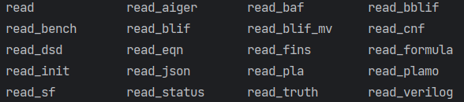
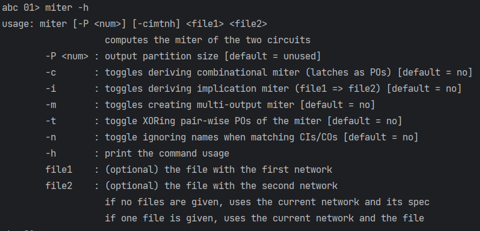
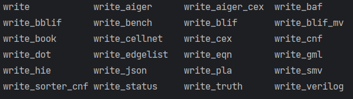

### ABC下载及安装
ABC介绍：见[ABC官网](https://people.eecs.berkeley.edu/~alanmi/abc/)

ABC下载：直接于GitHub的ABC库中下载源代码于自己的机器上编译：[ABC下载地址](https://github.com/berkeley-abc/abc)

ABC安装：在GitHub库的[README.md](https://github.com/berkeley-abc/abc/blob/master/README.md)中已经详细介绍，使用CMake或者Makefile等编译工具进行编译。\
需要注意的报错是关于READLINE库不存在的报错，若使用make编译，使用命令`make ABC_USE_NO_READLINE=1`即可；若使用CMake编译，就需要修改CMakeLists.txt文件，在关于READLINE库的编译条件处修改成：
```cmake
if(READLINE_FOUND MATCHES TRUE)
    addprefix(ABC_READLINE_INCLUDES_FLAGS "-I" ${READLINE_INCLUDE})
    string(REPLACE ";" " " ABC_READLINE_INCLUDES_FLAGS "${ABC_READLINE_INCLUDES_FLAGS}")
    list(APPEND ABC_READLINE_FLAGS "ABC_READLINE_INCLUDES=${ABC_READLINE_INCLUDES_FLAGS}")

    string(REPLACE ";" " " ABC_READLINE_LIBRARIES_FLAGS "${READLINE_LIBRARIES}")
    list(APPEND ABC_READLINE_FLAGS "ABC_READLINE_LIBRARIES=${ABC_READLINE_LIBRARIES_FLAGS}")
# elseif(READLINE_FOUND MATCHES FALSE)
else()
    list(APPEND ABC_READLINE_FLAGS "ABC_USE_NO_READLINE=1")
endif()
```
尽量在Linux环境下使用
### 制作Miter电路流程
我做的是CEC相关项目，大体思路是采用对一个电路使用resyn2重新综合后得到的新电路，将得到的新电路与原电路结合成Miter，这样一个检验的benchmark就做好了。
#### 流程
假设原电路文件为`o_file`，根据电路文件格式选择读入命令。ABC支持许多文件格式的读取：

\

现在打开ABC软件先将原电路读取：
```shell
./abc
read o_file
```
然后使用综合命令resyn2：
``` shell
resyn2
```
这时abc工作台上就是重新综合后的电路了，看到miter命令的信息：



那么miter命令后只跟一个文件时就是和当前工作台上的电路进行Miter过程，所以输入命令：
```shell
miter o_file
```
现在已经制作得到了Miter，需要将它输出，假设输出文件名为`n_file`。ABC同样支持许多文件格式的输出：



```shell
write n_file
```
最后的`n_file`就是需要的Miter电路文件了。

综合一下：
```shell
.\abc
read o_file
resyn2
miter o_file
write n_file
```
当然，ABC还支持一条命令的输入格式：
```shell
./abc -c " r o_file; resyn2; miter o_file; write n_file"
```

### aig文件格式
简单来说就是`.aag`格式是易读的ASCII形式以aag开头，而`.aig`或者`.aiger`是难读的二进制格式以aig开头。具体差别见aiger的GitHub库：[FOEMAT](https://github.com/arminbiere/aiger/blob/master/FORMAT)。中文翻译见[转载](https://www.cnblogs.com/bacmive/p/14014837.html)。