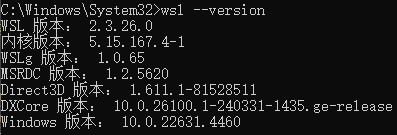
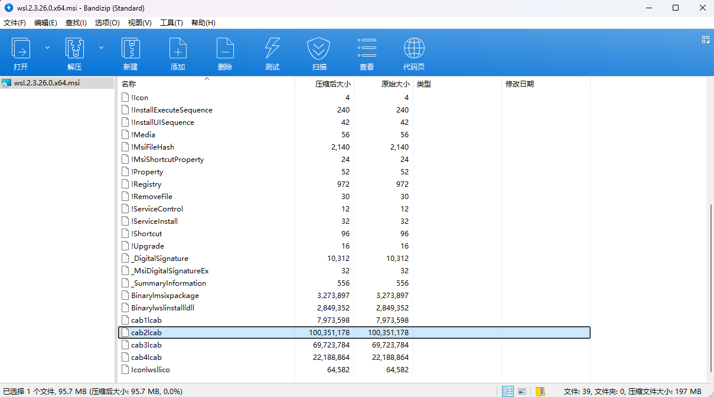
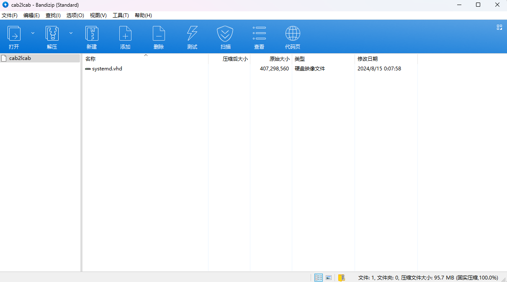
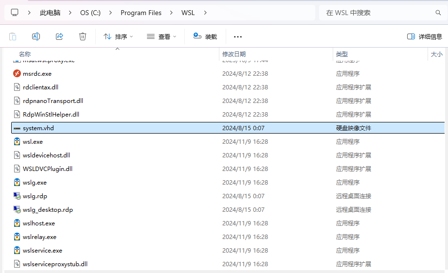

## 问题描述
在某次更新后，WSL突然挂掉，无法打开，因为Clion的CMake配置都在WSL的Linux系统中，所以需要尝试除了重新安装以外的解决方法。报错信息如下：

```shell
Failed to attach disk 'C:\Program Files\WSL\system.vhd' to WSL2: The system cannot find the file specified.
```

## 解决方法

#### 尝试1
1. 打开`Windows功能`，打开`虚拟机平台`和`适用于Linux的Windows子系统`。
2. 找到`Windows服务`，打开`WSL Service`和`Windows子系统Linux管理服务`。
3. 重启电脑。
   
发现没有任何作用，还是报出相同的错误。

#### 尝试2
在WSL2的Github issue中找到了相同的问题，有些人是重装了WSL2，但是重装后我的配置文件就会丢失，所以不想这么做。在issue中找到了一个解决方法，就是把自己对应版本的system.vhd文件提取出来，然后放到`C:\Program Files\WSL`下，然后重启WSL即可。具体操作如下：
1. 查看自己的WSL2版本，用管理员启动`cmd`，输入`wsl --version`，查看自己的WSL2版本。 
2. 在Github的[WSL2版本库](https://github.com/microsoft/WSL/releases)中找到对应版本的msi文件下载。
3. 使用压缩软件提取出`systemd.vhd`文件，该文件在cab2lcab中，所以需要先单独解压出cab2lcab，然后再解压cab2lcab提取出其中的`systemd.vhd`文件。 
4. 注意其中的`systemd.vhd`文件，将其重命名为`system.vhd`放到`C:\Program Files\WSL`下，然后重启WSL即可。

这样，我们的WSL2中就重新有了它的`system.vhd`文件，就可以正常打开了。同样用管理员启动`cmd`，输入`wsl`，就可以正常打开WSL2了。

#### 参考
- [WSL2 Github issue](https://github.com/microsoft/WSL/issues/11069)
- [WSL2 无法将磁盘”C:\Program Files\WSL\system.vhd“ 附加到WSL2 系统找不到指定的文件](https://blog.csdn.net/weixin_37210821/article/details/139813668)